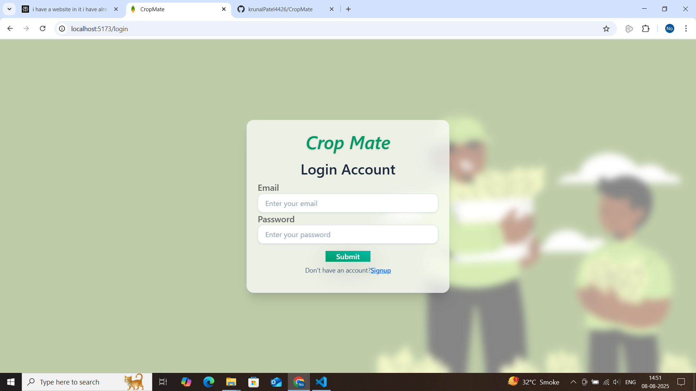
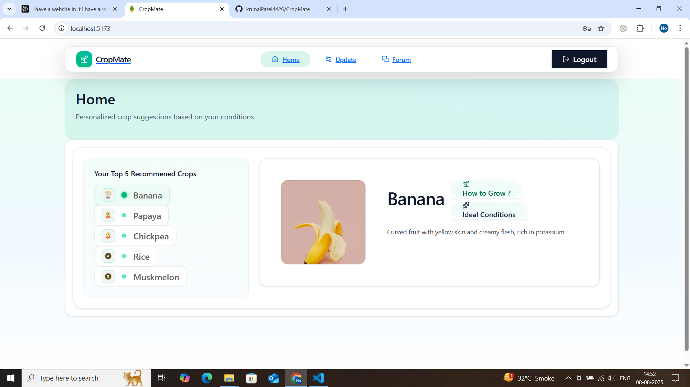
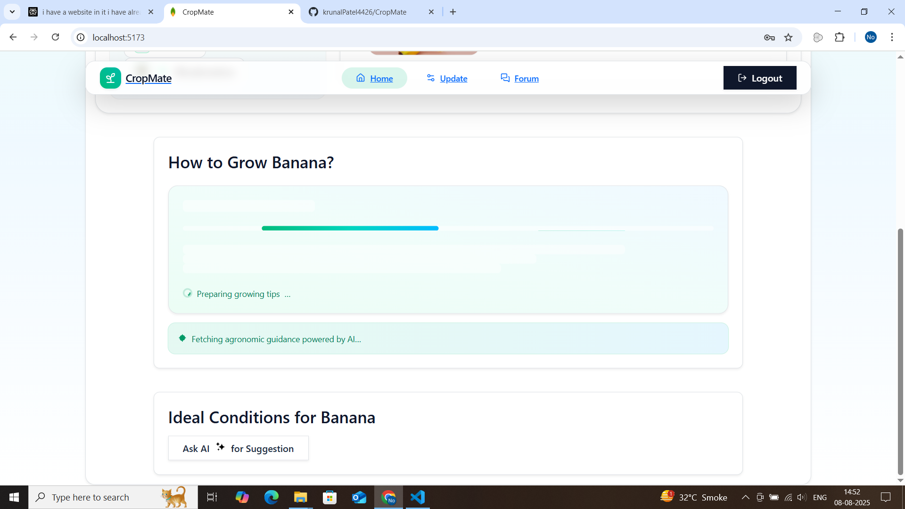
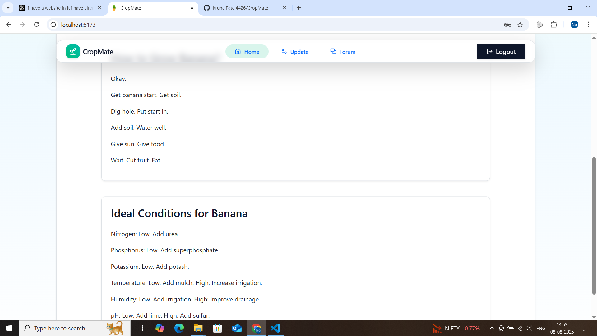
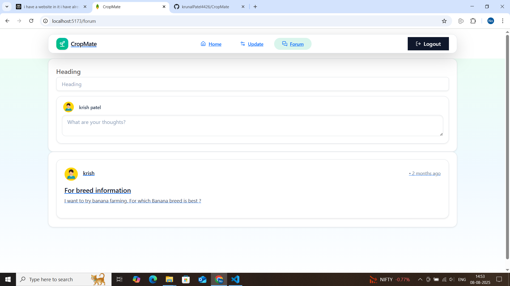
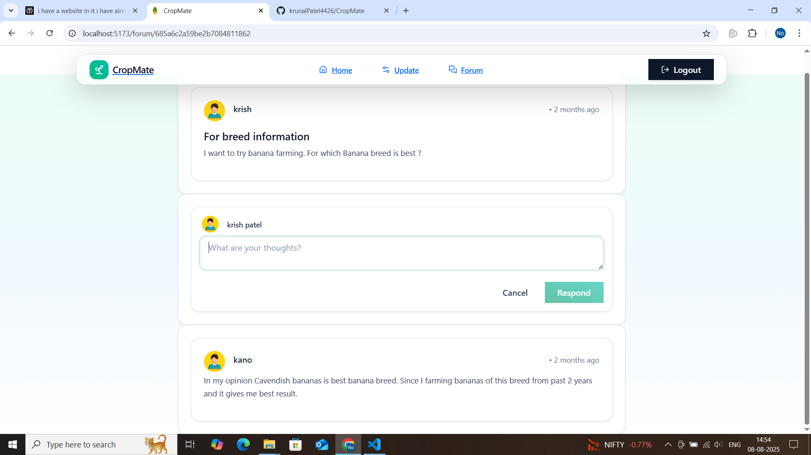
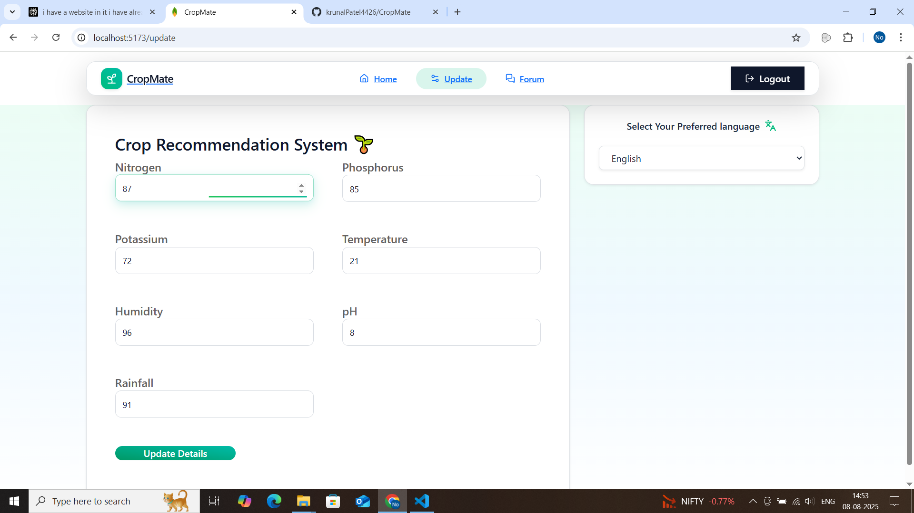

# CropMate 🌱

**A data-driven agricultural platform providing intelligent crop recommendations and fostering a collaborative farming community.**

CropMate is a comprehensive agricultural project aimed at revolutionizing farming practices by leveraging a modern tech stack and data-driven insights. It combines a user-friendly web application with a powerful, ensembled machine learning model to provide precise crop recommendations based on soil and environmental parameters.

## ✨ Features

-   **🤖 Intelligent Crop Recommendation**: Utilizes a Python-based machine learning model to provide personalized crop recommendations based on soil nitrogen, phosphorus, potassium, temperature, humidity, pH, and rainfall data.
-   **🌐 RESTful APIs**: Decoupled backend services with a primary MERN-stack API for core application logic and a dedicated Django API for ML model inference.
-   **🔐 Secure User Authentication**: Employs JWT (JSON Web Tokens) for secure session management and Bcrypt for robust password hashing, ensuring user data is always protected.
-   **🗣️ Community Forum**: A built-in forum that facilitates knowledge sharing, discussions, and collaboration among farmers and agricultural experts.
-   **👤 User Profile Management**: Allows users to sign up, log in, and manage their profiles securely.

## 🏛️ Architecture Overview

The project is built on a microservices-style architecture to ensure scalability and separation of concerns:

1.  **MERN Stack Server**: The primary backend built with Node.js and Express.js. It handles user authentication, community forum posts, comments, and all core application logic, interacting with a MongoDB database.
2.  **Django ML Service**: A dedicated Python backend powered by Django. Its sole responsibility is to host the pre-trained machine learning model and expose a single API endpoint (`/predict/`) to perform and return crop predictions.
3.  **React Frontend**: A dynamic and responsive single-page application that serves as the user interface, communicating with both backend services.

## 💻 Tech Stack

The project leverages a diverse set of modern technologies:

| Category                     | Technology                                                                                                    |
| ---------------------------- | ------------------------------------------------------------------------------------------------------------- |
| **Frontend**                 | `React.js`                                                                                                    |
| **Backend (Core Application)** | `Node.js`, `Express.js`, `Mongoose`                                                                           |
| **ML Service**               | `Python`, `Django`, `Django Rest Framework`, `Scikit-learn`, `NumPy`                                            |
| **Database**                 | `MongoDB`                                                                                                     |
| **Authentication**           | `JSON Web Tokens (JWT)`, `Bcrypt.js`                                                                          |
| **Deployment**               | `Docker (optional)`, `Heroku/Vercel (for frontend)`, `AWS/Heroku (for backends)`                              |

## 📂 Project Structure

The repository is organized into three main directories:
```
/
├── client/         # React.js frontend application
├── server/         # MERN stack backend (Node.js, Express)
├── crop_project/   # Django backend for serving the ML model
└── ml/             # Contains the ML model (e.g., model.pkl) and related notebooks
```

## 📸 Screenshots







